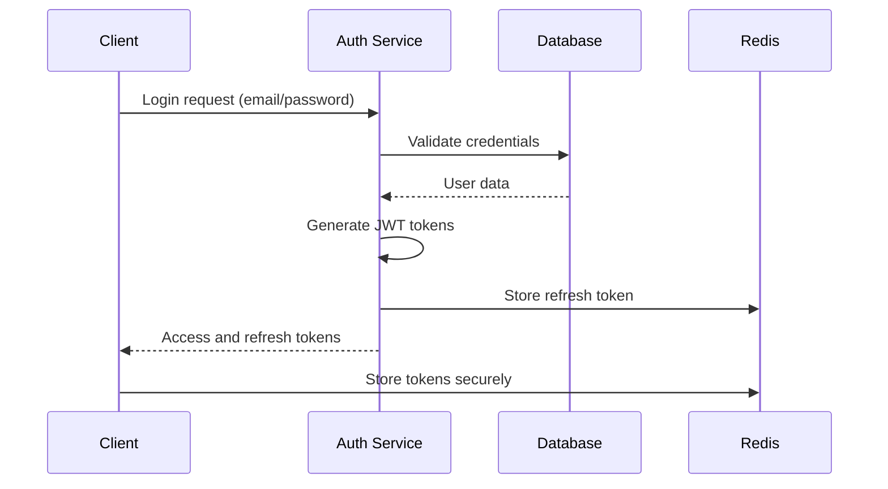

# NexusComm Architecture Documentation

## Overview

NexusComm is a sophisticated unified communication platform built on a modern, scalable microservices architecture. This document provides a comprehensive overview of the system's architecture, design principles, and technical decisions that enable NexusComm to deliver unparalleled communication experiences.

## Table of Contents
1. [System Overview](#system-overview)
2. [Architecture Principles](#architecture-principles)
3. [High-Level Architecture](#high-level-architecture)
4. [Microservices Architecture](#microservices-architecture)
5. [Data Layer](#data-layer)
6. [API Layer](#api-layer)
7. [Frontend Architecture](#frontend-architecture)
8. [Security Architecture](#security-architecture)
9. [DevOps and Infrastructure](#devops-and-infrastructure)
10. [Performance Considerations](#performance-considerations)
11. [Scalability Design](#scalability-design)
12. [Monitoring and Observability](#monitoring-and-observability)
13. [Disaster Recovery](#disaster-recovery)
14. [Technology Stack](#technology-stack)

## System Overview

NexusComm is designed to unify all personal, professional, and social digital communications into one intelligent, organized stream. The system provides:

- **Unified Inbox**: Chronologically sorted feed from all platforms
- **Thread Consolidation**: Messages from same contact across channels grouped together
- **Cross-Platform Messaging**: Send/receive via WhatsApp, Email, SMS, Instagram, LinkedIn, and more
- **AI-Powered Intelligence**: Smart responses, scheduling, and automation
- **Enterprise-Grade Security**: End-to-end encryption and zero-knowledge architecture
- **Advanced Analytics**: Comprehensive communication metrics and insights

## Architecture Principles

### 1. Modularity and Separation of Concerns
- Clear separation between presentation, business logic, and data layers
- Independent services with well-defined boundaries
- Loose coupling between components

### 2. Scalability and Performance
- Horizontal scaling capabilities
- Efficient resource utilization
- Caching strategies for performance optimization

### 3. Reliability and Fault Tolerance
- Redundancy in critical components
- Graceful degradation during failures
- Automated recovery mechanisms

### 4. Security by Design
- Defense-in-depth security approach
- Zero-trust architecture principles
- Regular security assessments and updates

### 5. Observability and Monitoring
- Comprehensive logging and metrics
- Real-time monitoring and alerting
- Distributed tracing for debugging

### 6. Developer Experience
- Consistent development patterns
- Comprehensive documentation
- Automated testing and deployment

## High-Level Architecture

```
┌─────────────────────────────────────────────────────────────────────┐
│                            CLIENT LAYER                             │
├─────────────────────────────────────────────────────────────────────┤
│  ┌─────────────┐  ┌─────────────┐  ┌─────────────┐  ┌─────────────┐ │
│  │   Mobile    │  │    Web      │  │   Desktop    │  │ Third-Party │ │
│  │   App       │  │   App       │  │   App       │  │ Integrations│ │
│  └─────────────┘  └─────────────┘  └─────────────┘  └─────────────┘ │
├─────────────────────────────────────────────────────────────────────┤
│                          API GATEWAY LAYER                          │
├─────────────────────────────────────────────────────────────────────┤
│  ┌─────────────┐  ┌─────────────┐  ┌─────────────┐  ┌─────────────┐ │
│  │   Load      │  │   Rate      │  │   Auth      │  │   Logging   │ │
│  │  Balancer   │  │  Limiting   │  │   Proxy     │  │    Proxy    │ │
│  └─────────────┘  └─────────────┘  └─────────────┘  └─────────────┘ │
├─────────────────────────────────────────────────────────────────────┤
│                        MICROSERVICES LAYER                         │
├─────────────────────────────────────────────────────────────────────┤
│  ┌─────────────┐  ┌─────────────┐  ┌─────────────┐  ┌─────────────┐ │
│  │  Messaging  │  │    AI       │  │   Contact    │  │   Analytics │ │
│  │   Service   │  │ Intelligence│  │  Management │  │   Service   │ │
│  └─────────────┘  └─────────────┘  └─────────────┘  └─────────────┘ │
│  ┌─────────────┐  ┌─────────────┐  ┌─────────────┐  ┌─────────────┐ │
│  │   Scheduling │  │   Voice     │  │    CRM      │  │   Security  │ │
│  │   Service   │  │ Processing  │  │   Service   │  │   Service   │ │
│  └─────────────┘  └─────────────┘  └─────────────┘  └─────────────┘ │
├─────────────────────────────────────────────────────────────────────┤
│                           DATA LAYER                                │
├─────────────────────────────────────────────────────────────────────┤
│  ┌─────────────┐  ┌─────────────┐  ┌─────────────┐  ┌─────────────┐ │
│  │  PostgreSQL │  │    Redis    │  │   MongoDB   │  │    Kafka    │ │
│  │   Primary   │  │   Cache     │  │  Secondary  │  │  Streaming  │ │
│  │   DB        │  │             │  │   Storage   │  │   Broker    │ │
│  └─────────────┘  └─────────────┘  └─────────────┘  └─────────────┘ │
├─────────────────────────────────────────────────────────────────────┤
│                        INFRASTRUCTURE LAYER                         │
├─────────────────────────────────────────────────────────────────────┤
│  ┌─────────────┐  ┌─────────────┐  ┌─────────────┐  ┌─────────────┐ │
│  │   Docker    │  │ Kubernetes  │  │    Nginx    │  │  Monitoring │ │
│  │ Containers  │  │   Orchest.  │  │  Reverse    │  │     Stack   │ │
│  └─────────────┘  └─────────────┘  │   Proxy     │  │             │ │
│                                   └─────────────┘  └─────────────┘ │
└─────────────────────────────────────────────────────────────────────┘
```

## Microservices Architecture

### Core Services

#### 1. Authentication Service
- **Responsibilities**: User authentication, session management, token generation
- **Technologies**: JWT, OAuth 2.0, bcrypt
- **Dependencies**: PostgreSQL, Redis
- **API Endpoints**: `/auth/login`, `/auth/register`, `/auth/refresh`

#### 2. Messaging Service
- **Responsibilities**: Message processing, routing, delivery status tracking
- **Technologies**: Socket.IO, Bull.js, PostgreSQL
- **Dependencies**: Account Service, Contact Service, Redis
- **API Endpoints**: `/messages`, `/conversations`

#### 3. Account Service
- **Responsibilities**: Account management, platform connections, sync coordination
- **Technologies**: TypeORM, OAuth clients
- **Dependencies**: PostgreSQL, External APIs
- **API Endpoints**: `/accounts`, `/accounts/:id/connect`

#### 4. Contact Service
- **Responsibilities**: Contact management, relationship mapping, group management
- **Technologies**: PostgreSQL, Redis
- **Dependencies**: Account Service, Messaging Service
- **API Endpoints**: `/contacts`, `/groups`

#### 5. AI Intelligence Service
- **Responsibilities**: Smart responses, tone analysis, draft generation, emotion detection
- **Technologies**: OpenAI API, Natural Language Processing
- **Dependencies**: Messaging Service, Contact Service
- **API Endpoints**: `/ai/smart-responses`, `/ai/analyze-tone`

#### 6. Scheduling Service
- **Responsibilities**: Message scheduling, automation rules, trigger processing
- **Technologies**: Bull.js, Cron
- **Dependencies**: Messaging Service, Contact Service
- **API Endpoints**: `/scheduling`, `/automation`

#### 7. Voice Processing Service
- **Responsibilities**: Voice transcription, emotion detection, command processing
- **Technologies**: WebRTC, Speech Recognition APIs
- **Dependencies**: Messaging Service, AI Intelligence Service
- **API Endpoints**: `/voice/process`, `/voice/analyze`

#### 8. Analytics Service
- **Responsibilities**: Metrics collection, insight generation, reporting
- **Technologies**: PostgreSQL, TimescaleDB
- **Dependencies**: All services
- **API Endpoints**: `/analytics`, `/insights`

#### 9. CRM Service
- **Responsibilities**: Customer relationship management, opportunity tracking
- **Technologies**: PostgreSQL, Business Logic Engine
- **Dependencies**: Contact Service, Messaging Service
- **API Endpoints**: `/crm/contacts`, `/crm/opportunities`

#### 10. Security Service
- **Responsibilities**: Encryption, access control, audit logging
- **Technologies**: OpenSSL, PKI, Access Control Lists
- **Dependencies**: All services
- **API Endpoints**: `/security`, `/privacy`

### Service Communication Patterns

#### Synchronous Communication
- RESTful APIs for direct service-to-service calls
- GraphQL for complex data fetching requirements
- gRPC for high-performance internal service communication

#### Asynchronous Communication
- Message queues (Bull.js, RabbitMQ) for decoupled processing
- Event streaming (Apache Kafka) for real-time data processing
- WebSockets for bidirectional real-time communication

#### Service Discovery
- Kubernetes service discovery for containerized deployments
- Consul for service registry and health checking
- Istio service mesh for advanced traffic management

## Data Layer

### Primary Database (PostgreSQL)
```sql
-- Users table
CREATE TABLE users (
    id UUID PRIMARY KEY DEFAULT gen_random_uuid(),
    email VARCHAR(255) UNIQUE NOT NULL,
    username VARCHAR(50) UNIQUE NOT NULL,
    password_hash VARCHAR(255) NOT NULL,
    display_name VARCHAR(100),
    profile_picture TEXT,
    is_email_verified BOOLEAN DEFAULT FALSE,
    created_at TIMESTAMP DEFAULT NOW(),
    updated_at TIMESTAMP DEFAULT NOW()
);

-- Messages table
CREATE TABLE messages (
    id UUID PRIMARY KEY DEFAULT gen_random_uuid(),
    conversation_id UUID NOT NULL REFERENCES conversations(id),
    user_id UUID NOT NULL REFERENCES users(id),
    content TEXT NOT NULL,
    channel_type VARCHAR(50) NOT NULL,
    direction VARCHAR(10) NOT NULL CHECK (direction IN ('inbound', 'outbound')),
    status VARCHAR(20) DEFAULT 'sent',
    is_read BOOLEAN DEFAULT FALSE,
    media_urls TEXT[] DEFAULT '{}',
    metadata JSONB DEFAULT '{}',
    created_at TIMESTAMP DEFAULT NOW(),
    updated_at TIMESTAMP DEFAULT NOW()
);

-- Conversations table
CREATE TABLE conversations (
    id UUID PRIMARY KEY DEFAULT gen_random_uuid(),
    user_id UUID NOT NULL REFERENCES users(id),
    participant_ids UUID[] NOT NULL,
    participant_names TEXT[] NOT NULL,
    channels VARCHAR(50)[] NOT NULL,
    last_message TEXT,
    last_message_timestamp TIMESTAMP,
    unread_count INTEGER DEFAULT 0,
    is_pinned BOOLEAN DEFAULT FALSE,
    is_muted BOOLEAN DEFAULT FALSE,
    is_archived BOOLEAN DEFAULT FALSE,
    created_at TIMESTAMP DEFAULT NOW(),
    updated_at TIMESTAMP DEFAULT NOW()
);
```

### Caching Layer (Redis)
```javascript
// Cache structure examples
const cacheKeys = {
    // User session data
    userSession: (userId) => `user:${userId}:session`,
    
    // Conversation cache
    conversation: (convId) => `conv:${convId}`,
    
    // Message cache
    message: (msgId) => `msg:${msgId}`,
    
    // Rate limiting
    rateLimit: (userId, endpoint) => `rate:${userId}:${endpoint}`,
    
    // Online status
    onlineStatus: (userId) => `online:${userId}`,
    
    // Recent messages
    recentMessages: (convId) => `recent:${convId}`
};
```

### NoSQL Storage (MongoDB)
Used for:
- Analytics data and metrics
- Unstructured log data
- Media metadata and processing queues
- User preferences and settings

### Streaming Data (Apache Kafka)
Topics:
- `message.created` - New messages
- `message.updated` - Message status updates
- `conversation.updated` - Conversation changes
- `user.activity` - User activity tracking
- `system.events` - System-level events

### Data Flow Patterns

#### Write Path
1. API receives request
2. Validation and preprocessing
3. Write to primary database (PostgreSQL)
4. Publish event to message queue
5. Update cache (Redis)
6. Return response

#### Read Path
1. API receives request
2. Check cache first (Redis)
3. If cache miss, query database (PostgreSQL)
4. Update cache with result
5. Return response

#### Background Processing
1. Worker consumes from message queue
2. Process business logic
3. Update database as needed
4. Publish completion events
5. Update relevant caches

## API Layer

### RESTful API Design
Following RESTful principles with:
- Resource-based URLs
- Standard HTTP methods (GET, POST, PUT, DELETE)
- Proper HTTP status codes
- JSON request/response bodies
- HATEOAS for API discoverability

### GraphQL API
For complex queries and real-time subscriptions:
```graphql
type Query {
  user(id: ID!): User
  conversations(limit: Int, offset: Int): [Conversation!]!
  messages(conversationId: ID!, limit: Int, offset: Int): [Message!]!
}

type Subscription {
  messageAdded(conversationId: ID!): Message
  conversationUpdated(userId: ID!): Conversation
}

type Mutation {
  sendMessage(input: SendMessageInput!): Message
  createConversation(input: CreateConversationInput!): Conversation
}
```

### API Gateway
Features:
- Authentication and authorization
- Rate limiting and throttling
- Request/response transformation
- Load balancing
- SSL termination
- Logging and monitoring
- Circuit breaker pattern

### Versioning Strategy
- URI versioning: `/api/v1/`
- Semantic versioning for breaking changes
- Backward compatibility maintained for minor versions
- Deprecation notices for upcoming changes

## Frontend Architecture

### Mobile App (React Native)
Structure:
```
src/
├── components/          # Reusable UI components
├── screens/            # Application screens
├── navigation/         # Navigation setup
├── services/           # API and business logic
├── stores/             # State management (Zustand)
├── hooks/              # Custom hooks
├── utils/              # Utility functions
├── assets/             # Images, fonts, etc.
└── types/              # TypeScript definitions
```

### Web App (React)
Structure:
```
src/
├── components/          # Reusable UI components
├── pages/               # Application pages
├── layouts/             # Page layouts
├── services/           # API integration
├── stores/              # State management (Zustand)
├── hooks/               # Custom hooks
├── utils/               # Utility functions
├── assets/              # Images, styles, etc.
├── routes/              # Routing configuration
└── types/               # TypeScript definitions
```

### State Management
Using Zustand for lightweight, scalable state management:
```javascript
// Global store structure
const useStore = create((set, get) => ({
  // Authentication state
  auth: {
    user: null,
    isAuthenticated: false,
    isLoading: false
  },
  
  // Conversation state
  conversations: {
    items: [],
    selectedId: null,
    isLoading: false,
    error: null
  },
  
  // Message state
  messages: {
    items: [],
    isLoading: false,
    error: null
  },
  
  // UI state
  ui: {
    sidebarOpen: true,
    theme: 'light',
    notifications: []
  }
}));
```

### Component Architecture
Following Atomic Design principles:
- **Atoms**: Basic building blocks (buttons, inputs, badges)
- **Molecules**: Groups of atoms (form fields, card headers)
- **Organisms**: Complex components (chat windows, sidebars)
- **Templates**: Page layouts
- **Pages**: Specific page implementations

## Security Architecture

### Authentication Flow


### Authorization Model
Using Role-Based Access Control (RBAC):
- **Roles**: Admin, User, Guest
- **Permissions**: Read, Write, Delete, Execute
- **Resources**: Users, Messages, Conversations, Settings
- **Scope**: Global, Organization, Team, Individual

### Data Encryption
- **At Rest**: AES-256 encryption for database and file storage
- **In Transit**: TLS 1.3 for all network communications
- **End-to-End**: Signal Protocol for message encryption
- **Key Management**: Hardware Security Modules (HSM) for key storage

### Security Controls
- **Input Validation**: Sanitization and validation at API boundary
- **Rate Limiting**: Adaptive rate limiting with burst protection
- **DDoS Protection**: Cloudflare and load balancer protection
- **Vulnerability Scanning**: Automated security scanning in CI/CD
- **Penetration Testing**: Quarterly third-party security assessments

### Compliance
- **GDPR**: Data protection and privacy controls
- **HIPAA**: Healthcare data handling (where applicable)
- **SOC 2**: Security and availability controls
- **PCI DSS**: Payment card data security (where applicable)

## DevOps and Infrastructure

### CI/CD Pipeline
Using GitHub Actions:
```yaml
# .github/workflows/ci.yml
name: CI/CD Pipeline
on: [push, pull_request]

jobs:
  test:
    runs-on: ubuntu-latest
    steps:
      - uses: actions/checkout@v2
      - name: Setup Node.js
        uses: actions/setup-node@v2
        with:
          node-version: '18'
      - name: Install dependencies
        run: npm ci
      - name: Run tests
        run: npm run test:ci
      - name: Code coverage
        run: npm run test:coverage

  build:
    needs: test
    runs-on: ubuntu-latest
    steps:
      - uses: actions/checkout@v2
      - name: Setup Docker
        uses: docker/setup-buildx-action@v1
      - name: Build and push
        uses: docker/build-push-action@v2
        with:
          context: .
          push: true
          tags: nexuscomm/backend:latest

  deploy:
    needs: build
    runs-on: ubuntu-latest
    steps:
      - name: Deploy to Kubernetes
        run: |
          kubectl set image deployment/nexuscomm-backend \
            nexuscomm-backend=nexuscomm/backend:latest
```

### Containerization
Docker images for all services:
```dockerfile
# Multi-stage Dockerfile
FROM node:18-alpine AS base
WORKDIR /app
COPY package*.json ./
RUN npm ci --only=production && npm cache clean --force

FROM base AS production
COPY . .
USER node
EXPOSE 3000
HEALTHCHECK --interval=30s --timeout=3s --start-period=5s --retries=3 \
  CMD curl -f http://localhost:3000/health || exit 1
CMD ["npm", "start"]
```

### Orchestration (Kubernetes)
Deployment manifests:
```yaml
apiVersion: apps/v1
kind: Deployment
metadata:
  name: nexuscomm-backend
spec:
  replicas: 3
  selector:
    matchLabels:
      app: nexuscomm-backend
  template:
    metadata:
      labels:
        app: nexuscomm-backend
    spec:
      containers:
      - name: backend
        image: nexuscomm/backend:latest
        ports:
        - containerPort: 3000
        resources:
          requests:
            memory: "256Mi"
            cpu: "250m"
          limits:
            memory: "512Mi"
            cpu: "500m"
        envFrom:
        - configMapRef:
            name: nexuscomm-config
        - secretRef:
            name: nexuscomm-secrets
        livenessProbe:
          httpGet:
            path: /health
            port: 3000
          initialDelaySeconds: 30
          periodSeconds: 10
        readinessProbe:
          httpGet:
            path: /health
            port: 3000
          initialDelaySeconds: 5
          periodSeconds: 5
```

### Infrastructure as Code
Using Terraform for cloud infrastructure:
```hcl
# main.tf
provider "aws" {
  region = var.aws_region
}

resource "aws_vpc" "nexuscomm" {
  cidr_block = "10.0.0.0/16"
  tags = {
    Name = "nexuscomm-vpc"
  }
}

resource "aws_ecs_cluster" "nexuscomm" {
  name = "nexuscomm-cluster"
}

resource "aws_rds_cluster" "nexuscomm" {
  cluster_identifier = "nexuscomm-db"
  engine             = "aurora-postgresql"
  master_username    = var.db_username
  master_password    = var.db_password
  skip_final_snapshot = true
}
```

## Performance Considerations

### Database Optimization
- **Indexing**: Strategic indexes on frequently queried columns
- **Partitioning**: Table partitioning for large datasets
- **Connection Pooling**: PgBouncer for efficient database connections
- **Query Optimization**: Query analysis and optimization
- **Caching**: Redis for frequently accessed data

### API Performance
- **Response Compression**: Gzip compression for API responses
- **Pagination**: Cursor-based pagination for large result sets
- **Batch Operations**: Support for batch requests to reduce round trips
- **Caching Strategies**: HTTP caching headers and CDN integration
- **Database Connection Management**: Efficient connection pooling

### Mobile App Performance
- **Lazy Loading**: Components loaded on demand
- **Image Optimization**: Progressive loading and compression
- **Bundle Splitting**: Code splitting for smaller bundles
- **Offline Caching**: Local storage for offline functionality
- **Background Processing**: Non-blocking operations

### Web App Performance
- **Code Splitting**: Dynamic imports for route-based splitting
- **Tree Shaking**: Elimination of unused code
- **Service Workers**: Caching and offline capabilities
- **Resource Preloading**: Critical resources preloaded
- **Render Optimization**: Virtual scrolling and windowing

## Scalability Design

### Horizontal Scaling
- **Microservices**: Independent scaling of services
- **Load Balancing**: Automatic load distribution
- **Auto-scaling**: Kubernetes HPA for automatic scaling
- **Database Sharding**: Horizontal partitioning for databases
- **Caching Layers**: Distributed caching for performance

### Vertical Scaling
- **Resource Allocation**: Dynamic resource allocation
- **Instance Types**: Different instance types for different workloads
- **Memory Management**: Efficient memory usage patterns
- **CPU Optimization**: Optimized compute resource usage

### Traffic Management
- **Rate Limiting**: Adaptive rate limiting
- **Circuit Breaking**: Fail-fast mechanisms
- **Traffic Shaping**: Weighted routing for deployments
- **Load Shedding**: Graceful degradation under high load

### Capacity Planning
- **Performance Testing**: Regular load testing
- **Capacity Monitoring**: Real-time capacity tracking
- **Growth Projections**: Predictive scaling based on trends
- **Resource Optimization**: Right-sizing of resources

## Monitoring and Observability

### Logging Strategy
Structured logging with:
- **Log Levels**: DEBUG, INFO, WARN, ERROR, FATAL
- **Correlation IDs**: Trace requests across services
- **Structured Fields**: JSON-formatted log entries
- **Centralized Storage**: Elasticsearch for log aggregation
- **Retention Policies**: Automated log rotation and cleanup

### Metrics Collection
Using Prometheus for metrics:
- **Application Metrics**: Custom business metrics
- **System Metrics**: CPU, memory, disk, network
- **Database Metrics**: Query performance, connection pools
- **API Metrics**: Request rates, latency, error rates
- **Business Metrics**: User engagement, feature usage

### Distributed Tracing
Using Jaeger for request tracing:
- **Span Propagation**: Context propagation across services
- **Trace Visualization**: End-to-end request visualization
- **Performance Analysis**: Bottleneck identification
- **Error Tracking**: Root cause analysis for failures

### Alerting System
- **Threshold-based Alerts**: CPU usage, memory usage, error rates
- **Anomaly Detection**: Machine learning for unusual patterns
- **Escalation Policies**: Multi-tier alert escalation
- **Notification Channels**: Email, Slack, SMS, PagerDuty

### Dashboard Design
- **Executive Dashboard**: High-level business metrics
- **Operations Dashboard**: System health and performance
- **Developer Dashboard**: Service-specific metrics
- **Security Dashboard**: Security events and incidents

## Disaster Recovery

### Backup Strategy
- **Database Backups**: Automated daily backups with point-in-time recovery
- **File Backups**: Incremental backups of user files and media
- **Configuration Backups**: Version-controlled configuration snapshots
- **Geographic Distribution**: Multi-region backup storage

### Recovery Procedures
- **RTO/RPO Targets**: Recovery Time Objective and Recovery Point Objective
- **Disaster Recovery Plan**: Step-by-step recovery procedures
- **Regular Testing**: Quarterly disaster recovery drills
- **Failover Mechanisms**: Automated failover between regions

### Business Continuity
- **Multi-Region Deployment**: Active-active deployment across regions
- **Service Redundancy**: Multiple instances of critical services
- **Data Replication**: Real-time data replication
- **Fallback Mechanisms**: Graceful degradation during outages

### Incident Response
- **Incident Classification**: Severity-based classification
- **Response Teams**: Dedicated incident response teams
- **Communication Plan**: Stakeholder communication protocols
- **Post-Incident Analysis**: Root cause analysis and improvement plans

## Technology Stack

### Backend
- **Runtime**: Node.js 18+
- **Framework**: Express.js with TypeScript
- **Database**: PostgreSQL 13+ with TypeORM
- **Caching**: Redis 6+
- **Message Queue**: Bull.js with Redis
- **Streaming**: Apache Kafka
- **Authentication**: JWT, OAuth 2.0
- **Testing**: Vitest, Supertest
- **Documentation**: Swagger/OpenAPI

### Frontend
- **Mobile**: React Native with Expo
- **Web**: React with TypeScript
- **State Management**: Zustand
- **Navigation**: React Navigation
- **UI Components**: Custom design system
- **Real-Time**: Socket.IO client
- **Testing**: Jest, React Testing Library

### Infrastructure
- **Containerization**: Docker
- **Orchestration**: Kubernetes
- **Load Balancing**: NGINX, HAProxy
- **Monitoring**: Prometheus, Grafana, ELK Stack
- **Tracing**: Jaeger
- **CI/CD**: GitHub Actions
- **Infrastructure**: Terraform, Ansible

### DevOps
- **Version Control**: Git with GitHub
- **Package Management**: npm
- **Code Quality**: ESLint, Prettier
- **Security Scanning**: OWASP ZAP, Snyk
- **Performance Testing**: Artillery, Lighthouse
- **Deployment**: Helm Charts, Kustomize

### Third-Party Services
- **AI Services**: OpenAI GPT models
- **Cloud Services**: AWS (primary), Azure, GCP (backup)
- **Communication APIs**: Twilio, WhatsApp Business API
- **Email Services**: SendGrid, Amazon SES
- **Payment Processing**: Stripe (where applicable)
- **CDN**: Cloudflare

### Development Tools
- **IDE**: VS Code
- **Debugging**: Chrome DevTools, Flipper
- **Profiling**: Node.js profiler, React DevTools
- **Collaboration**: GitHub, Slack, Notion
- **Design**: Figma, Zeplin

---

This architecture document provides a comprehensive overview of NexusComm's design and implementation approach. The system is built with scalability, security, and performance in mind, using modern technologies and best practices to deliver an exceptional user experience.